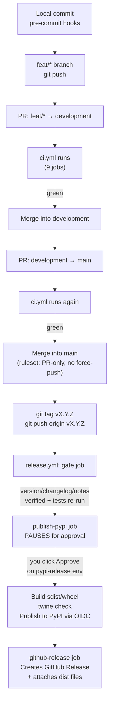

# CI/CD Pipeline: End-to-End Walkthrough

This document walks through the full pipeline, from a local `git commit` to a
live PyPI release — from code change → `development` → `main` → tag →
GitHub Actions → PyPI.

## High-level flow



## Stage by stage

### 1. Local commit — `.pre-commit-config.yaml`

Every `git commit` runs locally:

- `trailing-whitespace` / `end-of-file-fixer` / `check-added-large-files` / `check-yaml`
- `ruff check --fix` + `ruff format`
- `scripts/verify_structure.py` (single-source-of-truth project structure check)

This catches lint/formatting issues before anything even reaches GitHub.

### 2. PR into `development` — `ci.yml`

Triggers on `pull_request` / `push` to `development` or `main`. All jobs
`need: lint` (fails fast), then run in parallel:

| Job | What it does |
|---|---|
| Lint & structure | `ruff check` + `ruff format --check` + structure verifier |
| Unit tests (3.9/3.11/3.12) | `pytest tests/unit` with coverage |
| API tests | `pytest tests/api` against FastAPI `TestClient` |
| Container manager tests | Real Podman daemon on the runner, `pytest tests/container` |
| Kubernetes manager tests | Real `kind` cluster, `pytest tests/k8s` |
| Frontend smoke tests | Playwright against the real app boot |
| Package build | Builds sdist/wheel, `twine check`, installs into a clean venv, smoke-tests the CLI |
| Manifest validation | `kubeconform` against the K8s/OpenShift YAML manifests |
| Dependency audit | `pip-audit` (non-blocking, informational only) |

Everything funnels into **CI summary**, a single job meant to be the one
required status check. A `concurrency` group auto-cancels stale runs if you
push again before the first finishes.

### 3. Merge into `development`, then PR into `main`

`ci.yml` runs the exact same suite again on that PR. `main` has a
**ruleset** (not classic branch protection) requiring: no direct pushes, no
force-pushes/deletion, PR-only.

> **Note:** that ruleset currently doesn't have a `required_status_checks`
> rule wired to "CI summary" — so the merge button doesn't technically
> hard-block on red CI; it relies on manually checking green before merging.
> `development` itself has no ruleset at all (by deliberate choice — only
> `main` is protected).

### 4. Tag `main` and push the tag — `release.yml`

Only triggers on `v*.*.*` tag pushes (tags aren't branches, so `ci.yml`
doesn't also fire).

- **`gate`**: derives the version from the tag, verifies
  `vllm_playground/__init__.py`'s `__version__` matches it, verifies
  `releases/vX.Y.Z.md` exists, verifies `CHANGELOG.md` mentions the tag,
  then re-runs `tests/unit tests/api` as a final fast safety net.
- **`publish-pypi`**: targets the `pypi-release` GitHub **Environment**,
  which requires manual approval from the sole reviewer — the deliberate
  pause point. Once approved: builds sdist/wheel, `twine check`, publishes
  via **PyPI Trusted Publishing (OIDC)** (no stored token), uploads `dist/`
  as an artifact.
- **`github-release`**: downloads that artifact and creates a non-draft
  GitHub Release named after the tag, using `releases/vX.Y.Z.md` as the
  body, with the wheel/sdist attached.

## Explicit non-goals (removed from the pipeline)

- **Real `vllm` subprocess-mode E2E testing** — installing the actual
  `vllm` package and spawning a subprocess-mode model server is out of CI
  scope. It's an opt-in feature for users who choose subprocess mode on
  their own machine, not this project's primary (container-based) use
  case. (Also: plain `pip install vllm` resolves to the CUDA wheel, which
  hangs forever on a GPU-less runner — this is what broke the first
  `v0.1.9` release-gate run.)
- **Container/OpenShift image build checks** — building
  `containers/Containerfile.vllm-playground` / `openshift/Containerfile`
  is not automated anywhere in this pipeline (the Podman build alone took
  9+ minutes). If the Containerfiles ever need re-validating, build them
  manually before a release, e.g.:
  ```bash
  docker build -f containers/Containerfile.vllm-playground -t vllm-playground:test .
  ```

## Cutting a release (manual steps)

1. Bump `vllm_playground/__init__.py`'s `__version__`.
2. Add a `releases/vX.Y.Z.md` file with release notes.
3. Add a `CHANGELOG.md` entry mentioning `vX.Y.Z`.
4. Land that on `main` via the normal `feat/*` → `development` → `main` PR flow.
5. Tag `main`'s HEAD and push the tag:
   ```bash
   git tag -a vX.Y.Z -m "vX.Y.Z — <summary>" main
   git push origin vX.Y.Z
   ```
6. Watch `release.yml`. When `publish-pypi` pauses, approve the
   `pypi-release` environment deployment in the Actions tab.
7. Verify: `pip index versions vllm-playground` / check the
   [GitHub Releases page](https://github.com/micytao/vllm-playground/releases).

If a release-gate run fails after the tag is pushed, fix the issue, land it
through the normal PR flow, then delete and re-push the tag against the new
commit:

```bash
git tag -d vX.Y.Z
git push origin :refs/tags/vX.Y.Z
git tag -a vX.Y.Z -m "vX.Y.Z — <summary>" main
git push origin vX.Y.Z
```
